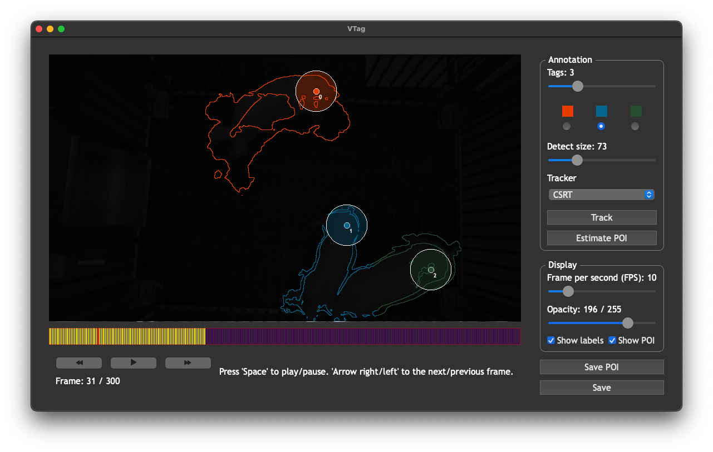

# Virtual Tag (VTag): a semi-supervised pipeline for tracking pig activity with a single top-view camera



## Installation

```bash
python -m pip install python-vtag
```
## Launch VTag

```bash
python -m vtag
```
